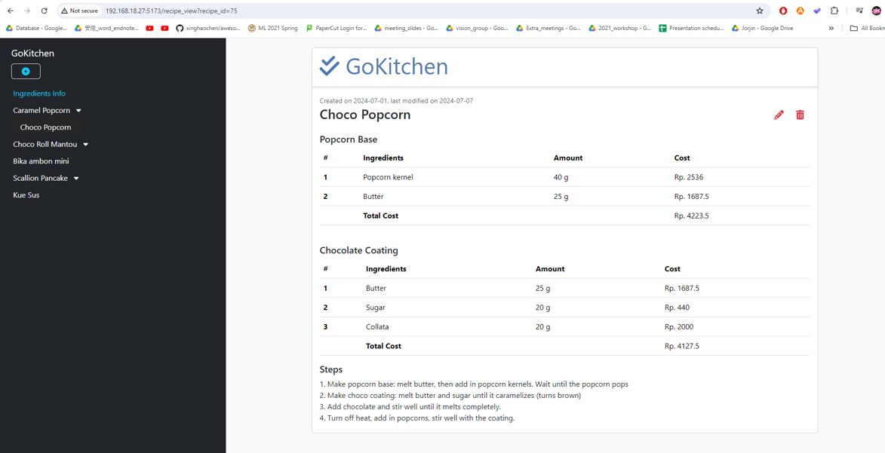
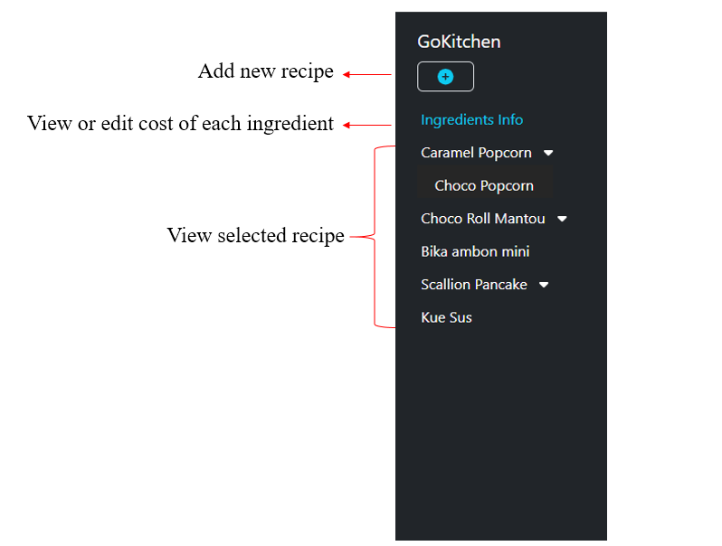
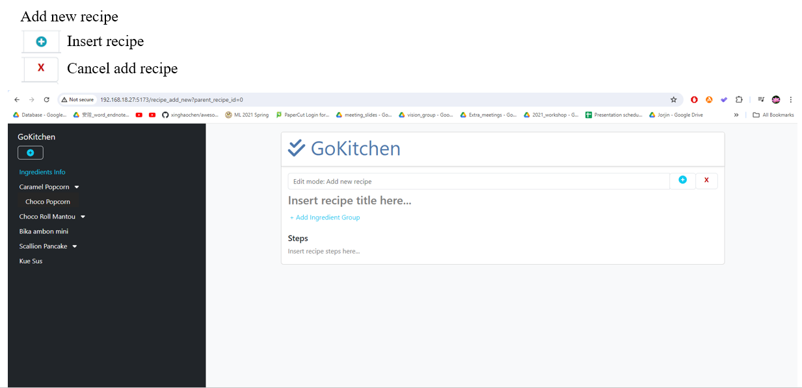
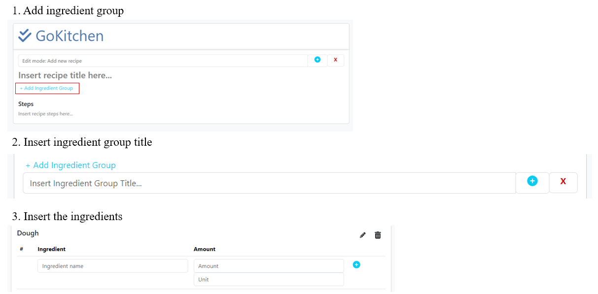
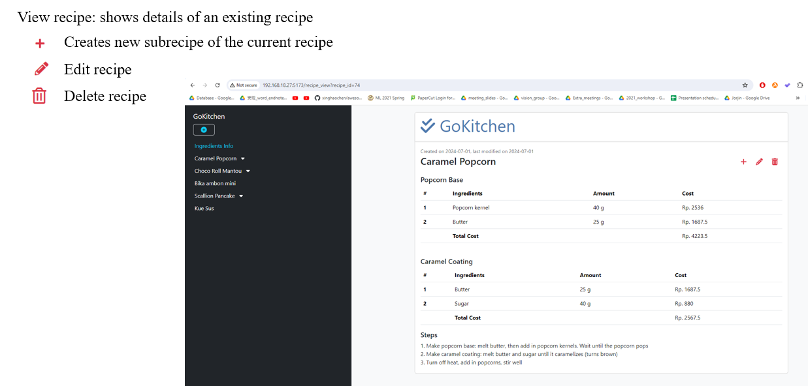
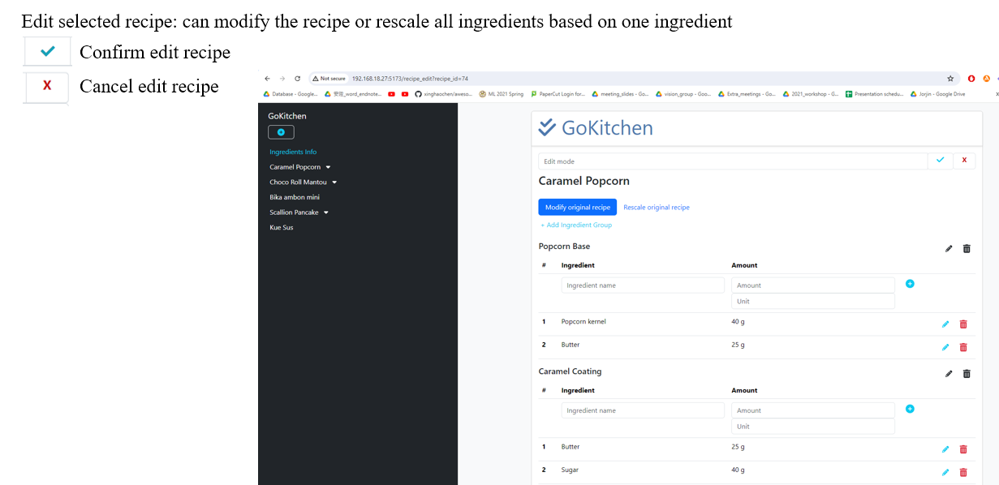
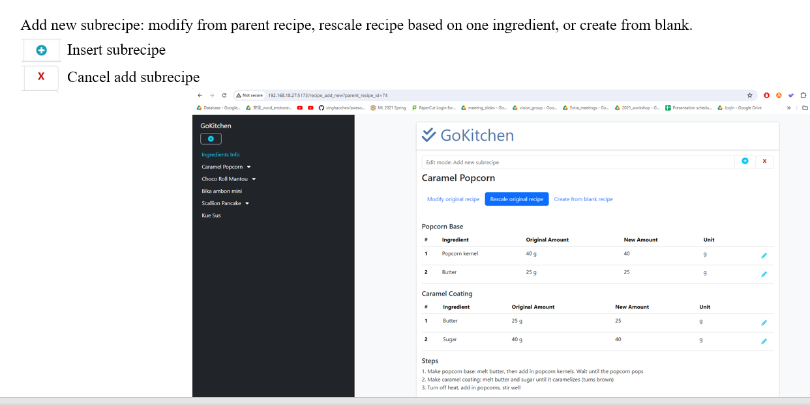
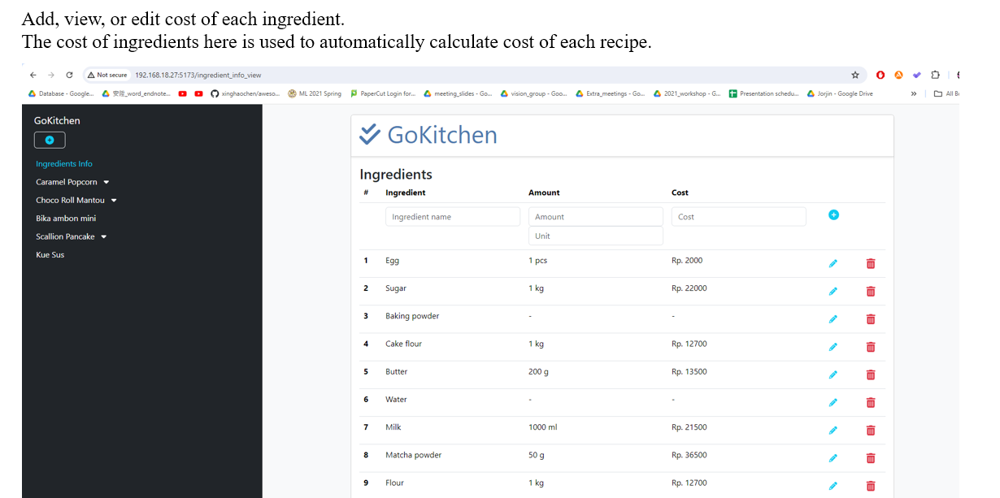

# Introduction
GoKitchen is a convenient web app for organizing recipes and calculating cost of the ingredients,
saving the time needed to calculate the cost manually based on the amount of the ingredient

Features:
- Record recipes
- Create modification of recipes easily
- Rescale recipes without needing to calculate amount of rescaled ingredients one by one
- Automatically calculate the cost based on listed ingredients



# Prerequisites:
Frontend: vue.js, bootstrap, font-awesome

Backend: golang

## Database setup
### Step 1: Create database in psql and connection setup in backend/src/db_mgmt/db_mgmt.go
```
const (
	host     = "localhost"
	port     = 5433
	user     = "postgres"
	password = "12345678"
	dbname   = "GoKitchenDB"
)
```

### Step 2: Create required tables
Table 1: recipes
```
CREATE TABLE recipes (
    "recipeID" SERIAL PRIMARY KEY NOT NULL,
    title TEXT NOT NULL,
    steps TEXT NOT NULL,
    "parentRecipeID" INT NOT NULL DEFAULT 0,
    "isRescaled" BOOLEAN NOT NULL DEFAULT FALSE,
    "createdDate" TEXT NOT NULL,
    "lastModifiedDate" TEXT NOT NULL
);
```

Table2: ingredientCategory
```
CREATE TABLE "ingredientCategory" (
    "categoryID" SERIAL PRIMARY KEY NOT NULL,
    "recipeID" INT NOT NULL,
    "categoryName" TEXT NOT NULL,
);
```

Table 3: recipeIngredients
```
CREATE TABLE "recipeIngredients" (
    "recipeIngredientID" SERIAL PRIMARY KEY NOT NULL,
    "recipeID" INT NOT NULL,
    "categoryID" INT NOT NULL,
    "ingredientID" INT NOT NULL,
    amount TEXT NOT NULL,
    "amountUnit" TEXT NOT NULL
);
```

Table 4: ingredientInfo
```
CREATE TABLE "ingredientInfo" (
    "ingredientID" SERIAL PRIMARY KEY NOT NULL,
    "ingredientName" TEXT NOT NULL,
    cost INT NOT NULL,
    amount INT NOT NULL,
    "amountUnit" TEXT NOT NULL,
    CONSTRAINT unique_ingredient_name UNIQUE ("ingredientName")
);
```

Table 5: rescaleInfo
```
CREATE TABLE "rescaleInfo" (
    "recipeID" INT NOT NULL,
    "ingredientID" INT NOT NULL,
    "newAmount" INT NOT NULL,
    CONSTRAINT unique_recipe UNIQUE ("recipeID")
);
```

# Running the app
Frontend web server:
```
cd frontend/gokitchen
npm run dev
```
Backend server:
```
cd backend
go run main.go
```

# UI Introduction
## Sidebar


## Add new recipe


### Insert ingredient steps


## View recipe


## Edit recipe page


## Add new subrecipe


## Ingredient info page

